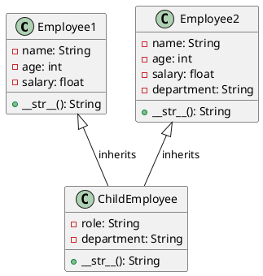

The code defines a scenario of class inheritance and composition in Python, utilizing object-oriented programming principles. It creates a hierarchy of employee classes to model different attributes and behaviors of employees. Here's a detailed explanation of each part:

### `Employee1` Class
- This is a basic class that initializes an employee with `name`, `age`, and `salary` attributes.
- The `__str__` method is overridden to provide a human-readable string representation of the `Employee1` object, displaying its `name`, `age`, and `salary`.

### `Employee2` Class
- Similar to `Employee1`, but with an additional `department` attribute. This class models another aspect of an employee, possibly to represent employees in a different context or with additional details.
- The `department` attribute is optional (`None` by default) to allow initialization of `Employee2` objects without specifying a department.
- The `__str__` method is overridden to include the `department` in the string representation of the `Employee2` object.

### `ChildEmployee` Class
- Inherits from both `Employee1` and `Employee2`. This is an example of multiple inheritance, where a class is derived from more than one base class.
- The `__init__` method explicitly calls `Employee1`'s initializer with `name`, `age`, and `salary` parameters. This is necessary because Python doesn't automatically call the constructors of all parent classes in multiple inheritance scenarios; you must explicitly call them if you need them both.
- It introduces a new attribute, `role`, specific to the `ChildEmployee` class, to represent the employee's role within the organization.
- The `department` attribute is set directly in the `ChildEmployee` class, assuming the intention is to utilize the attribute from `Employee2`. However, this setup doesn't explicitly call `Employee2`'s constructor to initialize `department`, which could lead to confusion or inconsistency. A more robust approach would involve calling both parent class constructors if they don't conflict or merging their functionalities in a single base class or through composition.
- The `__str__` method uses `super().__str__()` to call the string representation method of the first parent class (`Employee1`) in the method resolution order (MRO) and then extends it by appending the `role` and `department` information. This approach might not work as expected due to the MRO and how multiple inheritance is handled in Python. Specifically, `super().__str__()` will only invoke the `__str__` method of `Employee1` due to Python's method resolution order, ignoring `Employee2`'s version.

### Example Usage and Output
- Two instances of `ChildEmployee` are created with different attributes and printed.
- The output for each `ChildEmployee` instance includes their name, age, salary, role, and department, formatted as specified in the `ChildEmployee` class's `__str__` method.

### Important Consideration
- The code's approach to inheritance and method overriding, especially with the `__str__` method and how `department` is handled, could lead to confusion. A clearer and more consistent design might involve rethinking the class hierarchy, possibly combining `Employee1` and `Employee2` into a single base class if they represent the same conceptual entity with optional attributes. Alternatively, using composition over inheritance by including an `Employee` object within a `ChildEmployee` object might offer more flexibility and clarity.

The code demonstrates an example of **multiple inheritance**, where a class (`ChildEmployee`) inherits from more than one parent class (`Employee1` and `Employee2`). In multiple inheritance, a derived class can inherit attributes and methods from all the parent classes, allowing it to combine or extend functionalities defined in multiple base classes.

In Python, multiple inheritance introduces complexity, especially regarding method resolution order (MRO) and how constructors (`__init__` methods) are called. Python uses a specific order, known as the C3 linearization (or MRO), to determine how to traverse parent classes, which affects the behavior of `super()` calls.

In this specific case, `ChildEmployee` inherits from both `Employee1` and `Employee2`. However, the implementation explicitly calls the constructor of `Employee1` within the `__init__` method of `ChildEmployee` and manually sets the `department` attribute from `Employee2` without calling `Employee2`'s constructor. This approach is chosen to deal with the shared attributes among the parent classes and to add or customize additional attributes (`role` and `department`) in the `ChildEmployee` class.

