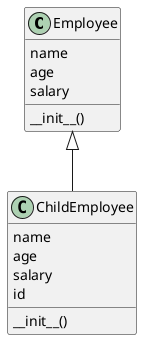
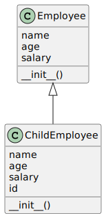

The provided code demonstrates inheritance in Python by defining two classes, `Employee` and `ChildEmployee`, where `ChildEmployee` inherits from `Employee`. 

Let's break down the components and functionality of this code.

### Class Definition: Employee

```python
class Employee:
    def __init__(self, name, age, salary):
        self.name = name
        self.age = age
        self.salary = salary
```

- **`Employee`** is a base class that defines a simple employee with three attributes: `name`, `age`, and `salary`.
- **`__init__(self, name, age, salary)`** is the constructor method used to initialize instances of the `Employee` class. This method assigns the `name`, `age`, and `salary` parameters to the instance variables of the same name.

### Class Definition: ChildEmployee

```python
class ChildEmployee(Employee):
    def __init__(self, name, age, salary, id):
        super().__init__(name, age, salary)
        self.id = id
```

- **`ChildEmployee(Employee)`** signifies that `ChildEmployee` is a subclass of `Employee`, inheriting its properties and behaviors. This is an example of inheritance, a fundamental concept of object-oriented programming.
- **`super().__init__(name, age, salary)`** calls the constructor of the `Employee` (parent) class. This allows `ChildEmployee` to inherit the initialization from `Employee`, avoiding the duplication of code for setting `name`, `age`, and `salary`.
- **`self.id = id`** additionally defines an `id` attribute for `ChildEmployee` instances, extending the functionality of the `Employee` class. This shows how inheritance can be used to extend and customize the behavior of parent classes.

### Object Instantiation and Printing

```python
emp1 = Employee('harshit', 22, 1000)
childEmp = ChildEmployee('Doosan', 36, 2500, 3087)

print(emp1.age)
print(f'Hello {childEmp.id}')
```

- **`emp1 = Employee('harshit', 22, 1000)`** creates an instance of `Employee` named `emp1` with the specified name, age, and salary.
- **`childEmp = ChildEmployee('Doosan', 36, 2500, 3087)`** creates an instance of `ChildEmployee` with the specified name, age, salary, and an additional `id` attribute, showcasing the extended functionality of the subclass.
- **`print(emp1.age)`** prints the `age` of `emp1`, demonstrating access to an attribute of an `Employee` instance.
- **`print(f'Hello {childEmp.id}')`** prints a greeting that includes the `id` of `childEmp`, demonstrating access to the extended attribute defined in `ChildEmployee`.

### Summary

This code illustrates the concept of inheritance in Python, where the `ChildEmployee` class inherits attributes and methods from the `Employee` class and adds additional functionality. It demonstrates how subclasses can extend and customize parent class behavior while reusing code, adhering to the DRY (Don't Repeat Yourself) principle. The example also shows object instantiation and how to access attributes of both parent and child class instances.

The inheritance demonstrated in the provided code is an example of **single inheritance**. In single inheritance, a subclass inherits from exactly one parent class, extending or modifying its behavior. The subclass (`ChildEmployee`) extends the functionality of its parent class (`Employee`) by adding new attributes or methods (in this case, the `id` attribute) while still retaining the characteristics and behaviors of the parent class.

Here's a brief overview of how single inheritance is represented in the code:

- The `Employee` class defines the base characteristics of an employee, including `name`, `age`, and `salary`.
- The `ChildEmployee` class inherits from `Employee` and adds an additional attribute (`id`), showcasing the subclass's ability to extend the parent class's functionality.
- The `ChildEmployee` class uses `super().__init__(name, age, salary)` to call the parent class's constructor, ensuring that the inherited attributes are initialized according to the parent class's definition.

This structure allows `ChildEmployee` to have all the attributes and methods of `Employee`, plus any additional ones defined in `ChildEmployee`, following the principle of single inheritance.



