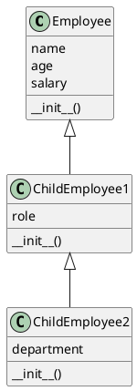
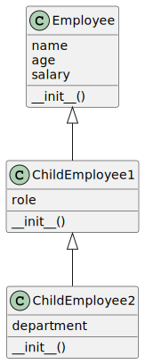

To streamline the code and adhere to best practices in Python, the child classes should only override or extend the functionality of their parent class when necessary. If a child class does not need to modify the inherited behavior, it does not need to redefine the inherited methods, including the `__init__` method. Here's how the code could be more appropriately written:

### Original Superclass: Employee
The `Employee` class remains unchanged as it is the base class providing the initial attributes and behavior for all employees.

```python
class Employee:
    def __init__(self, name, age, salary):
        self.name = name
        self.age = age
        self.salary = salary
```

### Simplified First Child Class: ChildEmployee1
Since `ChildEmployee1` does not add any new functionality or modify existing behavior from its parent class `Employee`, it can actually be omitted unless it's meant to be extended with additional features in the future. For demonstration purposes, if we were to keep it without adding any new features, it would look like this:

```python
class ChildEmployee1(Employee):
    pass
```

However, if `ChildEmployee1` was intended to have additional attributes or methods, you would include those in its definition. For example, if `ChildEmployee1` has a new attribute `role`, it could be defined as follows:

```python
class ChildEmployee1(Employee):
    def __init__(self, name, age, salary, role):
        super().__init__(name, age, salary)
        self.role = role
```

### Simplified Second Child Class: ChildEmployee2
Similar to `ChildEmployee1`, `ChildEmployee2` can be simplified by removing the unnecessary redefinition of the `__init__` method unless it's intended to extend or modify the functionality inherited from `ChildEmployee1`.

If no modifications are needed:

```python
class ChildEmployee2(ChildEmployee1):
    pass
```

And with modifications, for instance, adding a new attribute `department`:

```python
class ChildEmployee2(ChildEmployee1):
    def __init__(self, name, age, salary, role, department):
        super().__init__(name, age, salary, role)
        self.department = department
```

### Summary
By removing unnecessary redefinitions of the `__init__` method where no additional attributes or modifications are needed, the code becomes cleaner, more readable, and adheres to the DRY (Don't Repeat Yourself) principle. This approach makes it easier to maintain and understand the relationships between classes and their hierarchies.


When simplifying the inheritance structure as proposed, without unnecessary redefinitions of methods that do not modify or extend the parent class's behavior, the inheritance type does not inherently change based on the simplification alone. However, the manner in which classes are designed to extend or inherit from one another can be categorized into different types of inheritance, depending on the relationships and the hierarchy established.

Given the original setup and the proposed simplification:

1. **Original Structure (Before Simplification):** The inheritance was of a **multilevel inheritance** type, where `ChildEmployee1` inherits from `Employee`, and `ChildEmployee2` inherits from `ChildEmployee1`, creating a chain or a "grandparent-parent-child" relationship.

2. **After Simplification:** The inheritance type essentially remains **multilevel inheritance** if you consider the relationship between `Employee`, `ChildEmployee1`, and `ChildEmployee2` in a scenario where `ChildEmployee1` and `ChildEmployee2` might have additional attributes or methods. If `ChildEmployee1` and `ChildEmployee2` are kept in the hierarchy without modification to the `__init__` method (using `pass` or by adding specific attributes/methods in their definitions), the multilevel inheritance structure is maintained. This is because the inheritance chain still exists, even if some classes do not add or modify functionality.

In the scenario where `ChildEmployee1` and `ChildEmployee2` are explicitly designed to extend the functionality of their parent class by adding new attributes or methods, the inheritance demonstrates a clear example of multilevel inheritance, with each level introducing new properties or behaviors.

To summarize, the proposed simplification maintains the **multilevel inheritance** type, characterized by a hierarchy where classes inherit from other classes in a linear fashion, potentially adding or extending functionality at each level.




