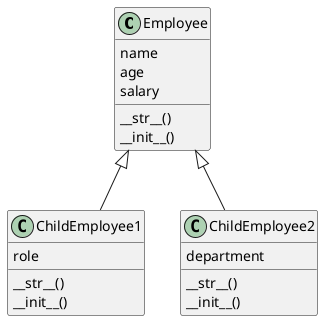

# To enhance the code by adhering to best practices in Python and avoiding redundancy, we'll make the following improvements

1. **Remove Redundant Overrides:** Since `ChildEmployee1` and `ChildEmployee2` do not modify the behavior of the `Employee` class's `__init__` method, there's no need to override it just to reassign the same attributes. We'll remove the redundant `__init__` methods from both child classes.

2. **Add Unique Features (Optional):** To justify the existence of child classes and demonstrate a more practical use of inheritance, we could add unique attributes or methods to `ChildEmployee1` and `ChildEmployee2`. For the purpose of this example, I'll add a `role` attribute to `ChildEmployee1` and a `department` attribute to `ChildEmployee2`, along with corresponding `__str__` methods to include these new attributes in their string representation.

Here's the enhanced version of the code:

```python
class Employee:
    def __init__(self, name, age, salary):
        self.name = name
        self.age = age
        self.salary = salary

    def __str__(self):
        return f'Employee(Name: {self.name}, Age: {self.age}, Salary: {self.salary})'

class ChildEmployee1(Employee):
    def __init__(self, name, age, salary, role):
        super().__init__(name, age, salary)
        self.role = role

    def __str__(self):
        return super().__str__() + f', Role: {self.role}'

class ChildEmployee2(Employee):
    def __init__(self, name, age, salary, department):
        super().__init__(name, age, salary)
        self.department = department

    def __str__(self):
        return super().__str__() + f', Department: {self.department}'

# Example usage
emp1 = ChildEmployee1('Harshit', 22, 1000, 'Engineer')
emp2 = ChildEmployee2('HHarshit', 23, 2000, 'HR')

print(emp1)
print(emp2)
```

## Enhancements Summary

- **Removed Redundancy:** By eliminating the unnecessary `__init__` method overrides in child classes that merely repeat the parent class's logic without modification, the code is cleaner and easier to maintain.
- **Added Unique Features:** By introducing unique attributes (`role` for `ChildEmployee1` and `department` for `ChildEmployee2`), each child class now has a distinct purpose, demonstrating a practical use of inheritance where child classes extend the parent class with additional functionality.
- **Customized String Representation:** Overriding the `__str__` method in child classes to include new attributes provides a clear, readable representation of each object, showing how child classes can enhance or modify inherited behavior.

Hierarchical inheritance occurs when multiple derived classes inherit from a single base class. This creates a hierarchy where the base class serves as a foundation, and each derived class extends the base class in different ways, but they do not inherit from each other.

The code provided is an example of hierarchical inheritance. Here's why:

- The `Employee` class serves as the base class or the parent class.
- Both `ChildEmployee1` and `ChildEmployee2` are derived from the `Employee` class. Each child class extends the `Employee` class with additional attributes and behaviors (`role` for `ChildEmployee1` and `department` for `ChildEmployee2`).

In this scenario, `Employee` is at the top of the hierarchy with `ChildEmployee1` and `ChildEmployee2` branching off from it as separate paths. They share a common ancestor (`Employee`) but represent different specializations or extensions of that ancestor. This setup allows different kinds of employees to be represented within the same system, leveraging the shared characteristics defined in `Employee` while also allowing for the specific characteristics that distinguish `ChildEmployee1` and `ChildEmployee2`.

So, to clarify, the code demonstrates hierarchical inheritance because multiple child classes (`ChildEmployee1` and `ChildEmployee2`) inherit from the same parent class (`Employee`), each extending it in their unique way.


